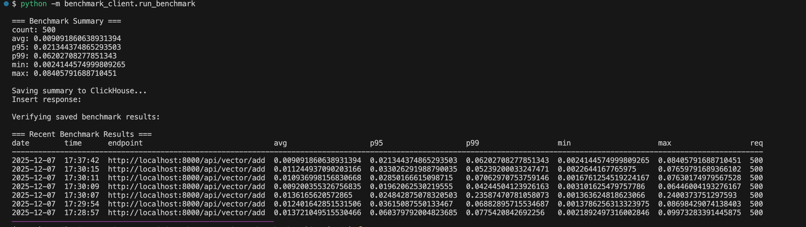
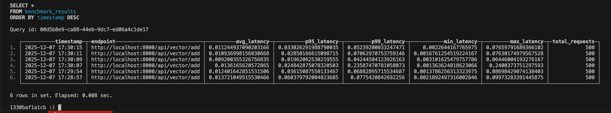

# **Benchmaker-Lite — FastAPI Benchmarking & Observability Pipeline**

[🔗 Live landing page:](https://slevinas.github.io/benchmaker-lite/)

<p align="left">
  
  
  
  
  
  
  
</p>

## Table of Contents

- [Overview](#overview)
- [Architecture](#architecture-overview)
- [Components](#️-components)
  - [FastAPI Benchmark Target](#1-api--fastapi-benchmark-target)
  - [Async Benchmark Client](#2-benchmark_client--async-python-runner)
  - [ClickHouse Layer](#3-clickhouse--db-layer)
  - [OpenTelemetry Collector](#4-otel--opentelemetry-collector)
- [Schema](#schema)
- [Running the Stack](#-running-the-entire-pipeline)
  - [Start Services](#1-start-dependencies)
  - [Run a Benchmark](#2-run-a-benchmark)
  - [Query Results](#3-query-results-manually)
- [Why This Project Exists](#-why-this-project)
- [Project Internals](#-project-internals)
- [Roadmap](#-roadmap)
- [License](#license)

---

#### Overview

Benchmaker-Lite is a **fully containerized benchmarking and observability system** built around:

- **FastAPI** (instrumented with OpenTelemetry)
- **OpenTelemetry Collector** (file + debug exporters)
- **ClickHouse** (analytics DB)
- **Async Python benchmark client** (httpx + asyncio)
- **Custom ClickHouse client** (env-driven config, JSONEachRow inserts)

It demonstrates real-world DevOps, observability, performance engineering, and backend automation patterns.

---

# **Architecture Overview**

> The benchmark output you see below is generated by this exact pipeline: async client → FastAPI target → OTEL Collector → ClickHouse.

```
                      ┌──────────────────────┐
                      │   Benchmark Client    │
                      │  (asyncio + httpx)    │
                      │  generate load / run  │
                      └───────────┬───────────┘
                                  │
                                  ▼
                     POST /api/vector/add (FastAPI)
                                  │
                                  ▼
                ┌────────────────────────────────────┐
                │        FastAPI Service              │
                │  - Vector-add endpoint              │
                │  - OTel instrumentation (SDK)       │
                │  - Emits traces & metrics           │
                └─────────────────┬───────────────────┘
                                  │  OTLP/gRPC
                                  ▼
               ┌──────────────────────────────────────┐
               │        OpenTelemetry Collector        │
               │  - Receives telemetry                 │
               │  - Batching processor                 │
               │  - Exports: file(traces), file(metrics) │
               │  - Debug exporter (stdout)            │
               └─────────────────┬────────────────────┘
                                  │
                              ETL / Ingest
                                  │
                                  ▼
              ┌────────────────────────────────────────┐
              │               ClickHouse                │
              │  - schema: benchmark_results           │
              │  - JSONEachRow inserts                 │
              │  - analytical queries (p95, p99, etc.) │
              └────────────────────────────────────────┘
```

---

# ⚙️ **Components**

### **1. `/api` — FastAPI Benchmark Target**

- Implements `/api/vector/add`
- Instrumented with OpenTelemetry SDK
- Emits traces & metrics to OTEL Collector
- Designed for load-generation & latency measurement

### **2. `/benchmark_client` — Async Python Runner**

- Uses `httpx.AsyncClient` + `asyncio`
- Launches concurrent workers
- Computes:

  - avg latency
  - p95, p99
  - min/max

- Stores structured results into ClickHouse
- Can fetch and display recent benchmark history

### **3. `/clickhouse` — DB Layer**

Includes:

- `client.py` (custom ClickHouse HTTP client)
- `init.sql` (schema definitions)
- Config-driven table design for benchmark analytics

Table:

```sql
CREATE TABLE benchmark_results (
    timestamp       DateTime DEFAULT now(),
    endpoint        String,
    avg_latency     Float64,
    p95_latency     Float64,
    p99_latency     Float64,
    min_latency     Float64,
    max_latency     Float64,
    total_requests  UInt32
) ENGINE = MergeTree()
ORDER BY (timestamp, endpoint);
```

### **4. `/otel` — OpenTelemetry Collector**

- Receives FastAPI telemetry
- Writes traces/metrics to local file
- Debug exporter for introspection

---

# 🐳 **Running the Entire Pipeline**

### **1. Start dependencies**

```bash
docker-compose up --build
```

This launches:

- ClickHouse
- OTEL Collector
- FastAPI benchmark service

### **2. Run a benchmark**

```bash
python -m benchmark_client.run_benchmark
```

Output:

```
=== Benchmark Summary ===
count: 500
avg: 0.0103s
p95: 0.0199s
p99: 0.0642s
min: 0.0041s
max: 0.0888s

Saving summary to ClickHouse...
Saved.

Fetching recent results...
timestamp                  avg_latency     p95_latency   total_requests
-----------------------------------------------------------------------
2025-12-05 13:24:33        0.0103           0.0199         500
...
```

### **3. Query results manually**

```sql
SELECT *
FROM benchmark_results
ORDER BY timestamp DESC
LIMIT 10;
```

---

# 📦 **Why This Project?**

This system simulates a **real observability + benchmarking pipeline**:

- Microservice exposing a performance-critical endpoint
- Telemetry instrumentation & OTEL ingestion
- Async load generation (multi-worker)
- Persistance to ClickHouse for analytics
- Queryable history of performance metrics

It showcases:

- DevOps automation
- Distributed tracing
- Telemetry pipelines
- Backend benchmarking
- Async Python tooling
- ClickHouse data engineering
- Docker Compose orchestration
- Practical, production-style architecture

---

# **🧩 Project Internals**

This project is structured around three core components:

---

## **1. FastAPI Service (`/api`)**

- Exposes benchmark endpoints (e.g., `/vector/add`).
- Instrumented with **OpenTelemetry SDK**.
- Sends traces/metrics to the **OpenTelemetry Collector** via OTLP/gRPC.
- Emits latency events that the benchmark client measures.

---

## **2. Benchmark Client (`/benchmark_client`)**

- Async load generator using **httpx + asyncio**.
- Computes:

  - average latency
  - p95 / p99 latency
  - min/max latency

- Saves structured summaries into ClickHouse using the **ClickHouseClient**.
- Optionally ETLs OTEL trace files into analytical tables.

---

## **3. ClickHouse Layer (`/clickhouse`)**

- Contains:

  - database schema (`init.sql`)
  - **ClickHouseClient** (Python wrapper for HTTP API)
  - future ETL tools for traces/metrics

- Central store for benchmark analytics.

Example summary row:

| total_requests | avg_latency | p95_latency | timestamp |
| -------------- | ----------- | ----------- | --------- |
| 500            | 0.008       | 0.021       | now()     |

---

## 📌 Roadmap

**Near-term (1–2 weeks)**

- [ ] Add latency histograms via OTEL Metrics SDK
- [ ] Add ClickHouse aggregation views (p95, p99, percentiles)
- [ ] Add automatic CSV export for benchmark reports
- [ ] Add Docker image publishing (GHCR)

**Mid-term (1 month)**

- [ ] Add distributed load testing mode (multiple workers)
- [ ] Store OTEL traces in ClickHouse for drill-down analysis
- [ ] Add Grafana dashboards (ClickHouse plugin)

**Long-term (future)**

- [ ] Support multiple benchmark targets
- [ ] Add gRPC benchmark target
- [ ] Add synthetic failure injection + resiliency testing mode
- [ ] Convert project into reusable Python package (`pip install benchmaker-lite`)

---

## 📊 Example Benchmark Output

The benchmark client runs a high-concurrency async workload against the FastAPI
endpoint (`/api/vector/add`), computes latency statistics (avg / p95 / p99 / min / max),
and writes the results into ClickHouse. Below is an example benchmark run:



---

## 📂 Stored Benchmark Results in ClickHouse

After each benchmark cycle, results are stored using `JSONEachRow` inserts.
This enables fast analytical queries against past runs:



---

## 📄 License

Released under the MIT License.  
See the `LICENSE` file for details.
